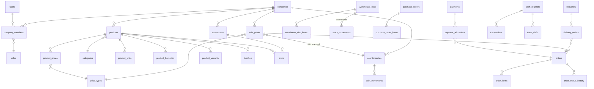

# MURCHA — Ma'lumotlar bazasi arxitekturasi

> PostgreSQL 17 + Prisma. Bu hujjat — Faza 0'dagi Prisma sxemaning asosi. Ustun nomlari ingliz tilida (kod standarti), izohlar o'zbekcha.

## 0. Umumiy printsiplar

- **Multi-tenant**: har tenant-jadvalda `company_id` (FK → companies). RLS policy: `company_id = current_setting('app.company_id')::uuid`
- **ID**: UUID v7, app darajasida generatsiya (`uuidv7` npm)
- **Vaqt**: hamma `timestamptz`, UTC'da saqlanadi
- **Soft-delete**: `deleted_at timestamptz null` — faqat spravochniklarda (products, counterparties...); jurnal/hujjatlarda YO'Q (ular storno bilan bekor qilinadi)
- **Immutable jurnallar**: `stock_movements`, `debt_movements`, `audit_logs`, `order_status_history` — INSERT only, UPDATE/DELETE DB darajasida taqiqlanadi (GRANT + trigger)
- **Pul**: `numeric(18,2)`, miqdor: `numeric(18,3)` (kasr — 2.5 kg). Hech qachon float emas
- **Hujjat raqamlari**: `doc_counters` orqali kompaniya+tur+yil kesimida ketma-ket (KIR-2026-00001)
- Har jadvalda: `created_at`, `updated_at` (jurnallardan tashqari — ularda faqat `created_at`)

## 1. ERD (asosiy bog'lanishlar)



## 2. Tashkilot va foydalanuvchilar

### companies
| ustun | tur | izoh |
|---|---|---|
| id | uuid PK | |
| name | text | |
| slug | text UNIQUE null | vitrina manzili murcha.uz/slug |
| logo_path | text null | MinIO'dagi yo'l |
| brand_color | text null | hex |
| showcase_settings | jsonb | vitrina: yoqilgan/katalog/narx turi |
| settings | jsonb | boshqa sozlamalar (ichki kurs rejimi...) |
| created_at, updated_at, deleted_at | timestamptz | |

### users
| ustun | tur | izoh |
|---|---|---|
| id | uuid PK | |
| phone | text UNIQUE | +998... E.164 format |
| password_hash | text | argon2 |
| full_name | text | |
| locale | text default 'uz' | uz/ru |
| status | text | active / blocked |
| last_login_at | timestamptz null | |

### company_members — user ↔ kompaniya
| ustun | tur | izoh |
|---|---|---|
| id | uuid PK | |
| company_id | uuid FK | |
| user_id | uuid FK | |
| role_id | uuid FK | |
| status | text | active / blocked — bloklansa barcha sessiyalar Redis'dan o'chadi |
| UNIQUE(company_id, user_id) | | |

### roles / permissions / role_permissions
- `roles`: id, company_id **null** (null = tizim tayyor rollari: owner, warehouse_manager, picker, shop_operator, courier, accountant), name, is_system bool
- `permissions`: id, code UNIQUE (masalan `orders.confirm`, `debts.view`) — seed'da qotirilgan statik ro'yxat
- `role_permissions`: role_id + permission_id (PK juftlik)

### user_assignments — hodimni obyektga biriktirish
company_member_id FK · target_type (`warehouse` | `sale_point`) · target_id uuid. Bo'sh = hamma obyekt (ega, buxgalter).

### audit_logs (immutable)
id · company_id · user_id · action (`create|update|confirm|cancel|delete|login`...) · entity_type · entity_id · before jsonb · after jsonb · ip · created_at.
Indeks: (company_id, entity_type, entity_id), (company_id, created_at).

## 3. Tuzilma

### warehouses
id · company_id · name · address · lat/lng numeric null · is_active bool.

### counterparties — postavshchik/mijoz
| ustun | tur | izoh |
|---|---|---|
| id, company_id | | |
| type | text | supplier / customer / both |
| name, phone | text | |
| tin | text null | STIR/ИНН — 2-bosqich ЭСФ uchun |
| credit_limit | numeric(18,2) null | null = cheksiz |
| payment_term_days | int default 0 | 0 = oldindan to'lov |
| is_active, deleted_at | | |

### sale_points — sotuv nuqtalari
id · company_id · **counterparty_id FK** (qarz hisobi shu orqali — har nuqtaga avtomatik counterparty ochiladi) · **price_type_id FK** (qaysi narxlarni ko'radi) · name · address · lat/lng · is_active.

## 4. Katalog

### categories
id · company_id · parent_id self-FK null · name_uz · name_ru null · sort int. Daraxt — adjacency list (MVP uchun yetadi).

### products
| ustun | tur | izoh |
|---|---|---|
| id, company_id | | |
| sku | text | UNIQUE(company_id, sku) |
| name_uz, name_ru | text / null | |
| description | text null | |
| category_id | uuid FK null | |
| brand, country | text null | |
| base_unit_id | uuid FK units | asosiy birlik — qoldiq shu birlikda |
| vat_rate | numeric(5,2) null | QQS % |
| ikpu_code | text null | ЭСФ uchun (2-bosqich, maydon hozirdan) |
| min_order_qty | numeric(18,3) null | minimal zakaz |
| order_multiple | numeric(18,3) null | karra (faqat blokda) |
| weight_kg, volume_m3 | numeric null | dostavka uchun |
| track_batches | bool default false | partiya/srok yuritiladimi |
| custom | jsonb default '{}' | qo'shimcha maydonlar |
| status | text | active / archived |
| deleted_at | | |

Indeks: GIN (name_uz gin_trgm_ops) — full-text qidiruv; (company_id, category_id).

### units / product_units
- `units`: id · company_id null (null = tizim: dona, kg, litr, metr, quti...) · name · short
- `product_units`: id · product_id · unit_id · **factor numeric(18,6)** — 1 shu birlik = factor × asosiy birlik (1 blok = 20 dona). UNIQUE(product_id, unit_id)

### product_barcodes
id · product_id · variant_id null · unit_id null (qaysi o'ram kodi) · barcode text. UNIQUE(company_id, barcode).

### product_images
id · product_id · path (MinIO) · thumb_path · is_main bool · sort int.

### price_types / product_prices (tarix bilan)
- `price_types`: id · company_id · name (ulgurji, chakana, VIP...) · is_default bool
- `product_prices`: id · product_id · variant_id null · price_type_id · **price numeric(18,2)** · **currency** (`UZS`|`USD`) · valid_from timestamptz · created_by. **UPDATE yo'q** — yangi narx = yangi qator; joriy narx = eng oxirgi valid_from. Indeks: (product_id, price_type_id, valid_from DESC)

### product_variants
id · product_id · sku null · name (masalan "Qizil / 42") · attributes jsonb (`{"rang":"qizil","o'lcham":"42"}`) · deleted_at.

### batches (partiya)
id · company_id · product_id · batch_no text null · expiry_date date null. FEFO: chiqimda expiry_date ASC tartibda tanlanadi.

## 5. Sklad harakati

### stock — joriy qoldiq (hisoblanadigan kesh)
| ustun | tur | izoh |
|---|---|---|
| id, company_id | | |
| warehouse_id, product_id | FK | |
| variant_id, batch_id | FK null | |
| quantity | numeric(18,3) | asosiy birlikda |
| reserved | numeric(18,3) default 0 | zakaz tasdiqlanganda ortadi |
| min_qty | numeric(18,3) null | low-stock chegara (sklad kesimida) |
| location | text null | polka/bo'lim |

UNIQUE(warehouse_id, product_id, variant_id, batch_id). **CHECK (quantity >= 0 AND reserved >= 0 AND reserved <= quantity)**. O'zgartirish faqat `SELECT ... FOR UPDATE` qulfli tranzaksiyada.

### warehouse_docs — yagona sklad hujjati (kirim/chiqim/spisaniye/ko'chirish)
| ustun | tur | izoh |
|---|---|---|
| id, company_id | | |
| type | text | receipt / issue / writeoff / transfer |
| number | text | KIR-2026-00001 (doc_counters) |
| warehouse_id | FK | transfer'da: chiqish sklad |
| to_warehouse_id | FK null | faqat transfer |
| counterparty_id | FK null | receipt: postavshchik |
| purchase_order_id | FK null | kirim zakaz asosida bo'lsa |
| status | text | draft / confirmed / cancelled |
| currency, exchange_rate | | USD kirim uchun |
| reason | text null | writeoff sababi (brak...) |
| total | numeric(18,2) | |
| confirmed_at, confirmed_by | | tasdiqlangach item'lar o'zgarmas |
| created_by, created_at, updated_at | | |

`warehouse_doc_items`: id · doc_id · product_id · variant_id/batch_id null · unit_id · qty (kiritilgan birlikda) · qty_base (asosiy birlikka o'girilgan) · price · total.

**Tasdiqlash oqimi** (bitta tranzaksiyada): status → confirmed + har item uchun `stock_movements` yozuvi + `stock` yangilanadi (qulf bilan). Bekor qilish = storno: teskari movements + status cancelled.

### stock_movements (immutable jurnal)
id · company_id · warehouse_id · product_id · variant_id/batch_id null · doc_type · doc_id · doc_item_id · **qty numeric(18,3) signed** (kirim +, chiqim −) · cost_price numeric null (o'rtacha tannarx hisobi uchun) · created_at · created_by.
Indeks: (company_id, product_id, created_at), (warehouse_id, product_id).
**Invariant (test)**: SUM(qty) per (warehouse, product, variant, batch) = stock.quantity.

### purchase_orders / purchase_order_items
- PO: id · company_id · supplier_id (counterparty) · warehouse_id · number · status (draft/sent/partially_received/received/cancelled) · expected_at · currency/rate · total
- Items: product_id · unit_id · qty · qty_received · price

### inventory_counts / inventory_count_items
- Count: id · company_id · warehouse_id · status (in_progress/review/approved) · started_by/at · approved_by/at
- Items: product_id · variant_id/batch_id · system_qty (boshlanganda fiksatsiya) · counted_qty · diff (generated). Approve → farqlar uchun avtomatik adjustment warehouse_doc.

### doc_counters
company_id · doc_type · year · counter int. UNIQUE(company_id, doc_type, year). Raqam olish `UPDATE ... RETURNING` bilan (race yo'q).

## 6. Savdo va dostavka

### orders — B2B zakaz
| ustun | tur | izoh |
|---|---|---|
| id, company_id | | |
| number | text | ZAK-2026-00001 |
| sale_point_id | FK | |
| warehouse_id | FK | qaysi skladdan |
| status | text | new / confirmed / picking / shipped / delivered / accepted / cancelled |
| payment_term_days | int | zakaz paytidagi qiymat (counterparty'dan ko'chiriladi) |
| due_date | date null | confirmed'da hisoblanadi |
| currency | text default 'UZS' | |
| subtotal, discount, total | numeric(18,2) | |
| idempotency_key | text | UNIQUE(company_id, idempotency_key) — dublikat zakaz yo'q |
| comment | text null | |
| created_by, confirmed_at, timestamps | | |

Indeks: (company_id, status), (sale_point_id, created_at DESC).
**Confirmed'da**: kredit limit tekshiruvi (Faza 8'dan) + stock.reserved ortadi. **Shipped'da**: reserved kamayadi + movements chiqim. **Accepted'da**: qty_accepted bo'yicha farqlar + debt_movement yoziladi.

`order_items`: id · order_id · product_id · variant_id null · unit_id · qty_ordered · qty_shipped · qty_accepted · qty_base_* (asosiy birlikda) · price · discount_pct · total.

`order_status_history` (immutable): order_id · from_status · to_status · by_user · comment · created_at.

### deliveries / delivery_orders / courier_locations
- `deliveries`: id · company_id · courier_member_id FK · date · status (assigned/on_route/done) · cash_expected · cash_collected · closed_at
- `delivery_orders`: delivery_id · order_id · sort_order · delivered_at null · accept_code text — bitta reys, bir nechta zakaz
- `courier_locations`: id · company_id · courier_member_id · lat/lng numeric(9,6) · recorded_at. Indeks (courier_member_id, recorded_at DESC). **Retention: 30 kun** — kunlik BullMQ job o'chiradi

### leads — vitrinadan so'rovlar
id · company_id · name · phone · message · items jsonb null (tanlangan mahsulotlar) · status (new/contacted/converted) · created_at.

## 7. Moliya

### cash_registers / cash_shifts
- `cash_registers`: id · company_id · name · type (cash/bank/card) · currency · is_active
- `cash_shifts`: id · cash_register_id · opened_by/at · opening_balance · expected_balance · counted_balance · diff · closed_by/at · comment

### transactions
id · company_id · cash_register_id · type (income/expense/transfer_out/transfer_in) · category_id FK null (`expense_categories`: id, company_id, name) · counterparty_id null · payment_id null · amount numeric(18,2) · currency · exchange_rate null · comment · created_by · occurred_at.
Indeks: (company_id, occurred_at), (cash_register_id, occurred_at).

### debt_movements (immutable — qarz jurnali)
| ustun | tur | izoh |
|---|---|---|
| id, company_id | | |
| counterparty_id | FK | |
| type | text | order (+) / payment (−) / return (−) / adjustment (±) / opening (boshlang'ich) |
| order_id, payment_id, doc_id | FK null | manba hujjat |
| amount | numeric(18,2) signed | + qarz oshdi, − kamaydi |
| currency | text | UZS (do'konlar) / USD (postavshchik mumkin) |
| due_date | date null | order turida |
| created_at, created_by | | |

Indeks: (counterparty_id, created_at), (company_id, currency).
**Invariant**: SUM(amount) per (counterparty, currency) = joriy balans. Aging: due_date bo'yicha ochiq qoldiqlar 0–15/16–30/31–60/60+.

### payments / payment_allocations
- `payments`: id · company_id · counterparty_id · amount · currency · method (cash/bank/card) · cash_register_id · received_by (kuryer bo'lishi mumkin) · delivery_id null · occurred_at
- `payment_allocations`: payment_id · order_id · amount — FIFO avtomatik yoki qo'lda. SUM(allocations.amount) <= payment.amount (CHECK servisda)

### exchange_rates
id · company_id **null** (null = CBU rasmiy) · currency · rate numeric(18,4) · rate_date date. UNIQUE(company_id, currency, rate_date). CBU — kunlik BullMQ job (cbu.uz API).

## 8. Tizim

### notifications
id · company_id · user_id · type (`order.new`, `debt.overdue`, `stock.low`...) · title · body · data jsonb (deep-link) · channel (inapp/push/sms) · read_at null · created_at. Indeks (user_id, read_at, created_at DESC).

### subscriptions
id · company_id UNIQUE · plan (free/start/business/corporate) · status (active/expired/trial) · paid_until date · limits jsonb (`{"warehouses":1,"users":1,"products":100}`) — limitlar service qatlamida tekshiriladi.

## 9. RLS siyosati (namuna)

```sql
ALTER TABLE products ENABLE ROW LEVEL SECURITY;
CREATE POLICY tenant_isolation ON products
  USING (company_id = current_setting('app.company_id')::uuid);
```

- Barcha tenant-jadvallarga bir xil policy (migratsiyada generatsiya qilinadi)
- API foydalanuvchisi (postgres roli) — RLS'dan ozod EMAS (`NOBYPASSRLS`); migratsiya roli alohida
- Prisma wrapper: har so'rov `$transaction` ichida `SELECT set_config('app.company_id', $1, true)` bilan boshlanadi (Faza 0 pattern)
- Istisno jadvallar (RLS'siz): users, doc_counters emas — doc_counters ham tenant. Faqat `users` global (company_members orqali bog'lanadi), `permissions`, tizim `units`/`roles` (company_id null qatorlar uchun alohida policy: `company_id IS NULL OR company_id = ...`)

## 10. Kelishuvlar (Prisma uchun)

- Jadval nomlari: snake_case ko'plik (`stock_movements`), Prisma modellar: PascalCase birlik (`StockMovement`) — `@@map` bilan
- Pul/miqdor: `Decimal` (Prisma) — hech qachon Float
- Enum'lar: Prisma enum emas, text + CHECK (o'zgartirish oson bo'lsin) — MVP qarori
- Har FK'ga indeks (Prisma avtomatik qilmaydi — qo'lda `@@index`)
- `onDelete`: spravochniklar `Restrict` (tarix buzilmaydi), item'lar `Cascade` (hujjat o'chsa item ham — faqat draft'da o'chirish mumkin)
